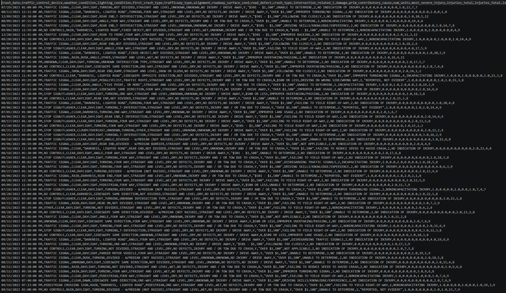

## Body

The United States Traffic Accident Data Set, 2016-2023

This dataset includes detailed information about traffic accidents from different regions and time periods. It covers various indicators such as the date of the accident, weather conditions, lighting conditions, types of collisions, injuries, and vehicle involvement. The data encompasses multiple locations and accident types, comprehensively demonstrating the causes and outcomes of traffic accidents.

Data statistics:
  crash_date: The date of the accident.
  traffic_control_device: The type of traffic control device involved (e.g., traffic signals, signs).
  weather_condition: The weather condition at the time of the accident.
  lighting_condition: The lighting condition at the time of the accident.
  first_crash_type: The initial type of collision (e.g., frontal collision, rear-end).
  trafficway_type: The type of road involved (e.g., highway, local road).
  alignment: The alignment of the road at the time of the accident (e.g., straight, curve).
  roadway_surface_cond: The condition of the road surface (e.g., dry, wet, icy).
  road_defect: Any defects on the road surface.
  crash_type: The overall type of the crash.
  intersection_related_i: Whether the accident is related to an intersection.
  damage: The degree of damage caused by the accident.
  prim_contributory_cause: The primary cause leading to the crash.
  num_units: The number of vehicles involved in the accident.
  most_severe_injury: The most severe injury sustained in the accident.
  injuries_total: The total number of reported casualties.
  injuries_fatal: The number of fatalities caused by the accident.
  injuries_incapacitating: The number of injuries that resulted in disability.
  injuries_non_incapacitating: The number of non-disabling injuries.
  injuries_reported_not_evident: The number of reported injuries but without clear indications.
  injuries_no_indication: The number of cases with no apparent injuries.
  crash_hour: The hour of the accident.
  crash_day_of_week: The day of the week the accident occurred.
  crash_month: The month of the accident.

## Images

Here is a pay link on Stripe ( https://buy.stripe.com/3cs8yP7sY87d0vu9AB ). Please contact me lonlonago@foxmail.com after funding $89, and I will send you a complete data files , thank you!

